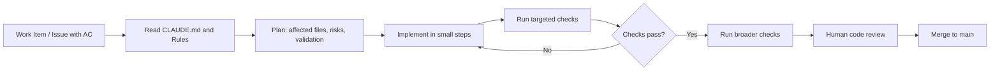

# AI Agent Workflow, Commands, and Validation

This file turns the governance rules into an operational workflow for AI coding agents and human reviewers.

## 1) Repository onboarding

On the first serious task in a repository, fill in the canonical commands below and keep them current. **This table must be completed before any code work begins.** An agent that reads unfilled placeholders must stop and request the missing commands rather than proceed with guesses.

| Concern | Canonical command | Fast file-scoped alternative | Notes |
| --- | --- | --- | --- |
| Install / setup | `npm install -g markdownlint-cli` | n/a | Install markdown linter globally |
| Build | n/a | n/a | Docs-only repo — no compile step |
| Lint | `markdownlint "**/*.md" --ignore node_modules` | `markdownlint path/to/file.md` | Markdown style check |
| Type check | n/a | n/a | No code — docs-only repo |
| Unit tests | n/a | n/a | No code — docs-only repo |
| Integration tests | n/a | n/a | No code — docs-only repo |
| Migrate / seed | n/a | n/a | No database |
| Start local services | n/a | n/a | No services required |
| Smoke test | `grep -rE "^\|.*\| fill me \|" . --include="*.md" && exit 1` | n/a | Verify no unfilled table cells remain; grep exits 1 (clean) or 0+exit (found) |
| Run locally | n/a | n/a | Static docs — no runtime |
| Security scan | `grep -rE "(password\|secret\|token\|api_key)\s*=\s*\S+" . --include="*.md"` | n/a | Scan for accidentally committed secrets |
| JSON validation | `python -m json.tool .claude/settings.example.json > /dev/null` | n/a | Verify settings example is valid JSON |
| YAML validation | `python -c "import yaml,sys; yaml.safe_load(open('.github/workflows/governance-check.yml'))"` | n/a | Verify CI workflow is valid YAML |
| Rollback | `git revert HEAD` | n/a | Revert last commit |

**Enforcement:** CI must include a step that fails the build if any cell in the command table above still contains the literal text `fill me`. A governance file that has never been completed gives false confidence that commands have been verified. Add a check equivalent to:

```bash
grep -E "^\|.*\| fill me \|" AI_AGENT_WORKFLOW.md && echo "ERROR: Unfilled command table in AI_AGENT_WORKFLOW.md" && exit 1
```

This check belongs in the repository's CI pipeline, not in agent instructions alone.

### Environment-qualified commands

Completing the command table is not enough by itself. Repositories should also
record command prerequisites explicitly whenever they matter.

Examples:

- Linux or WSL2 only
- Docker daemon required
- external simulator or peer service required
- CI-only check
- local-only convenience command

If the same repository has multiple validation layers, document which commands
belong to:

- fast local validation
- real dependency integration
- live or simulator-backed validation

An agent must not present a command as generally runnable if it only works in a
special environment.

**Example — Java / Maven / Spring Boot project:**

| Concern | Canonical command | Fast file-scoped alternative | Notes |
| --- | --- | --- | --- |
| Install / setup | `mvn install -DskipTests` | — | Installs dependencies |
| Build | `mvn package -DskipTests` | — | Produces target/*.jar |
| Lint | `mvn checkstyle:check` | — | Fails on style violations |
| Type check | n/a | — | Java is statically typed at compile |
| Unit tests | `mvn test` | `mvn test -Dtest=MyClassTest` | Runs JUnit tests |
| Integration tests | `mvn verify -P integration` | — | Requires local DB and broker |
| Migrate / seed | `mvn flyway:migrate` | — | Applies pending DB migrations |
| Start local services | `docker-compose up -d` | — | Starts PostgreSQL, Kafka, Redis |
| Smoke test | `curl -f http://localhost:8080/actuator/health` | — | Verifies app started correctly |
| Run locally | `mvn spring-boot:run` | — | Starts on port 8080 |
| Security scan | `mvn dependency-check:check` | — | OWASP dependency scan |
| Rollback | `mvn flyway:undo` | — | Reverts last migration |

**Example — Python / FastAPI / Poetry project:**

| Concern | Canonical command | Fast file-scoped alternative | Notes |
| --- | --- | --- | --- |
| Install / setup | `poetry install` | — | Installs all dependencies |
| Build | `poetry build` | — | Produces dist/ artifacts |
| Lint | `ruff check . && black --check .` | `ruff check src/mymodule.py` | Lint + format check |
| Type check | `mypy src/` | `mypy src/mymodule.py` | Static type analysis |
| Unit tests | `pytest tests/unit/` | `pytest tests/unit/test_foo.py` | Fast unit tests only |
| Integration tests | `pytest tests/integration/` | — | Requires running services |
| Migrate / seed | `alembic upgrade head` | — | Applies DB migrations |
| Start local services | `docker-compose up -d` | — | Starts PostgreSQL, Redis |
| Smoke test | `curl -f http://localhost:8000/health` | — | Verifies startup |
| Run locally | `uvicorn app.main:app --reload` | — | Dev server on port 8000 |
| Security scan | `bandit -r src/ && safety check` | — | SAST + dependency audit |
| Rollback | `alembic downgrade -1` | — | Reverts last migration |

## 2) Standard task flow

1. Read the task, acceptance criteria, and any linked design material.
2. Identify impacted files, callers, contracts, docs, tests, and operational behavior.
3. Write a short plan for any non-trivial task.
4. Define exact validation before coding.
5. Implement in small steps.
6. Run the smallest relevant checks first.
7. Run broader checks before finishing.
8. Summarize changes, commands run, outcomes, and remaining risks.
9. If the task is incomplete and will resume in a later session, write a progress summary to `tasks/handoff-<topic>.md` before stopping. Use `tasks/handoff-template.md` as the starting point.

> **Note on rule updates:** Reading CLAUDE.md and domain rules is the default first step. Editing governance rules is not part of normal feature work. Update a rule file only when a new pattern is discovered, the agent repeatedly makes the same mistake, or the team intentionally revises policy — and always as a standalone task with its own review. Capture the evidence first in `tasks/lessons.md` so the change has a concrete failure mode behind it.

## 3) Done checklist

A change is done only when all applicable items are true.

- [ ] Requested behavior is implemented.
- [ ] Backward-compatibility impact was assessed.
- [ ] If backward compatibility is broken, migration path and rollback plan are documented.
- [ ] External calls have explicit timeouts.
- [ ] Transient-failure behavior uses bounded retry / backoff where appropriate.
- [ ] Shared state has an explicit concurrency strategy.
- [ ] Logs include safe correlation metadata.
- [ ] No secrets or sensitive data were introduced into code or logs.
- [ ] Security and authorization boundary impact was considered.
- [ ] API, schema, or event contract versioning impact was assessed.
- [ ] Relevant unit tests were added or updated.
- [ ] Relevant integration or end-to-end checks were run when needed.
- [ ] Docs / config / examples were updated when behavior or setup changed.
- [ ] Cross-layer contract closure verified for any change touching an API route, event type, interface method, or shared data structure (Rule 12).
- [ ] If this closes a phase or milestone, slice exit evidence is complete — all deliverables exist, are wired, and have validation evidence (Rule 13).
- [ ] If work is incomplete and spans sessions, a handoff artifact exists in `tasks/` (Rule 14).
- [ ] A human reviewer can understand the change quickly.

## 4) Review summary template

Use this structure when reporting work:

- **Problem addressed:**
- **Files changed:**
- **Behavior changed:**
- **Backward-compatibility notes:**
- **Security impact:**
- **Risks and tradeoffs:**
- **Commands run:**
- **Scope:**
- **Results:**
- **Remaining gaps:**
- **Follow-up recommendations:**

## 5) Workflow diagram



## 6) Rollout and adoption plan

| Step | Action | Estimated time |
| --- | --- | --- |
| 1 | Place CLAUDE.md at repo root | 1–2 hours |
| 2 | Add `.claude/rules/*.md` domain files | 2–4 hours |
| 3 | Fill in all commands in Section 1 of this file | 1–2 hours |
| 4 | Configure CI to run build, lint, test, and security scan; fail on errors | 2–4 hours |
| 5 | Add commands and done-checklist reference to README | 30 minutes |
| 6 | Walk the team through the workflow: story → plan → AI code → test → review | 1–2 hours |
| 7 | Start a lessons log using `tasks/lessons.md` to capture repeat failures and process gaps | 30 minutes |
| 8 | Iterate: refine rules based on what the AI gets wrong in practice | Ongoing |
